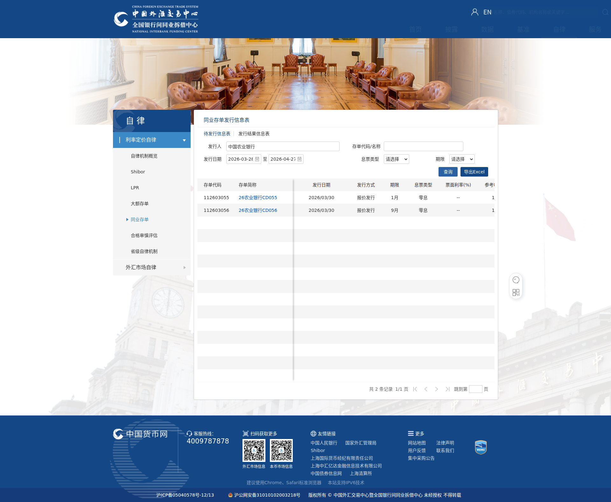

# Chinamoney CD Query

[](https://github.com/avalon/chinamoney-cd)
[](https://www.python.org/)
[](LICENSE)

查询中国货币网(chinamoney.com.cn)同业存单发行信息，支持40+家银行机构，精准匹配，一键获取待发行存单列表。

## ✨ 功能特点

- 🔍 **支持40+家银行** - 国有大行、股份制银行、城商行、农商行全覆盖
- 🎯 **智能精准匹配** - 输入"中国"只匹配"中国银行"，不会混淆其他银行
- 📊 **结构化输出** - 存单代码、发行日期、期限、发行方式一目了然
- 📸 **自动截图保存** - 查询结果自动截图，方便存档和分享
- ⚡ **快速查询** - 5秒内完成查询，实时获取最新数据

## 🏦 支持的银行

### 国有大行
工商银行、农业银行、中国银行、建设银行、交通银行、邮储银行

### 股份制银行
招商银行、民生银行、光大银行、中信银行、兴业银行、浦发银行、平安银行、华夏银行、广发银行、浙商银行、渤海银行、恒丰银行

### 城商行
北京银行、上海银行、江苏银行、南京银行、杭州银行、宁波银行、苏州银行、徽商银行、长沙银行、成都银行、重庆银行、青岛银行、厦门银行、西安银行等

### 农商行
重庆农商、上海农商、北京农商、深圳农商、成都农商、广州农商、东莞农商

### 政策性银行
国家开发银行、中国进出口银行、中国农业发展银行

## 📦 安装

### 前置依赖

```bash
# 安装 Playwright
pip install playwright
playwright install chromium
```

### 通过 OpenClaw 安装

```bash
openclaw skill install chinamoney-cd
```

### 手动安装

```bash
git clone https://github.com/avalon/chinamoney-cd.git ~/.openclaw/skills/chinamoney-cd
cd ~/.openclaw/skills/chinamoney-cd
pip install -r requirements.txt
```

## 🚀 使用方法

### 命令行调用

```bash
# 查询民生银行
python3 scripts/query_cd.py 民生

# 查询工商银行
python3 scripts/query_cd.py 工商

# 查询建设银行
python3 scripts/query_cd.py 建设

# 查询中国银行
python3 scripts/query_cd.py 中国

# 查询农业银行
python3 scripts/query_cd.py 农业

# 查询招商银行
python3 scripts/query_cd.py 招商
```

### 对话中使用

```
用户：查一下民生银行的同业存单
→ 返回查询结果和截图

用户：建设银行存单查询
→ 返回查询结果和截图

用户：中国银行有存单发行吗
→ 返回查询结果和截图
```

## 📋 输出示例

```
正在查询 [民生] 的同业存单信息...
查询结果: 共 1 条记录

截图已保存: /tmp/cd_result_民生.png

中国民生银行同业存单发行计划:

找到 1 条记录:

[1] 26民生银行CD080
    代码: 112615080
    发行日期: 2026/03/30
    发行方式: 报价发行
    期限: 9月
```

## 📸 查询结果展示

### 民生银行查询结果


### 建设银行查询结果


### 中国银行查询结果


### 农业银行查询结果


### 工商银行查询结果


## 🔧 技术实现

- **浏览器自动化**: Playwright + Chromium
- **页面解析**: 动态渲染页面抓取
- **数据匹配**: 智能银行名称映射表
- **截图保存**: 全页面截图

## 📁 文件结构

```
chinamoney-cd/
├── SKILL.md              # OpenClaw 技能文档
├── README.md             # 项目说明
├── LICENSE               # 许可证
├── requirements.txt      # Python 依赖
├── scripts/
│   └── query_cd.py       # 主查询脚本
└── screenshots/          # 展示截图
    ├── minSheng.png
    ├── jianShe.png
    ├── zhongGuo.png
    ├── nongYe.png
    └── gongShang.png
```

## ⚙️ 配置说明

无需额外配置，开箱即用。

## ⚠️ 注意事项

1. 需要网络连接访问中国货币网
2. 首次运行会自动下载 Chromium（约 100MB）
3. 查询结果截图保存在 `/tmp/cd_result_[银行名].png`
4. 非交易日数据可能为空

## 🤝 贡献

欢迎提交 Issue 和 PR！

## 📄 许可证

MIT License

## 📝 更新日志

### v1.0.0 (2026-03-28)
- 🎉 初始版本发布
- ✨ 支持40+家银行查询
- 🎯 智能精准匹配
- 📸 自动截图和结构化输出

## 🙏 致谢

- 数据来源: [中国货币网](https://www.chinamoney.com.cn/)
- 开发框架: [OpenClaw](https://openclaw.ai/)
